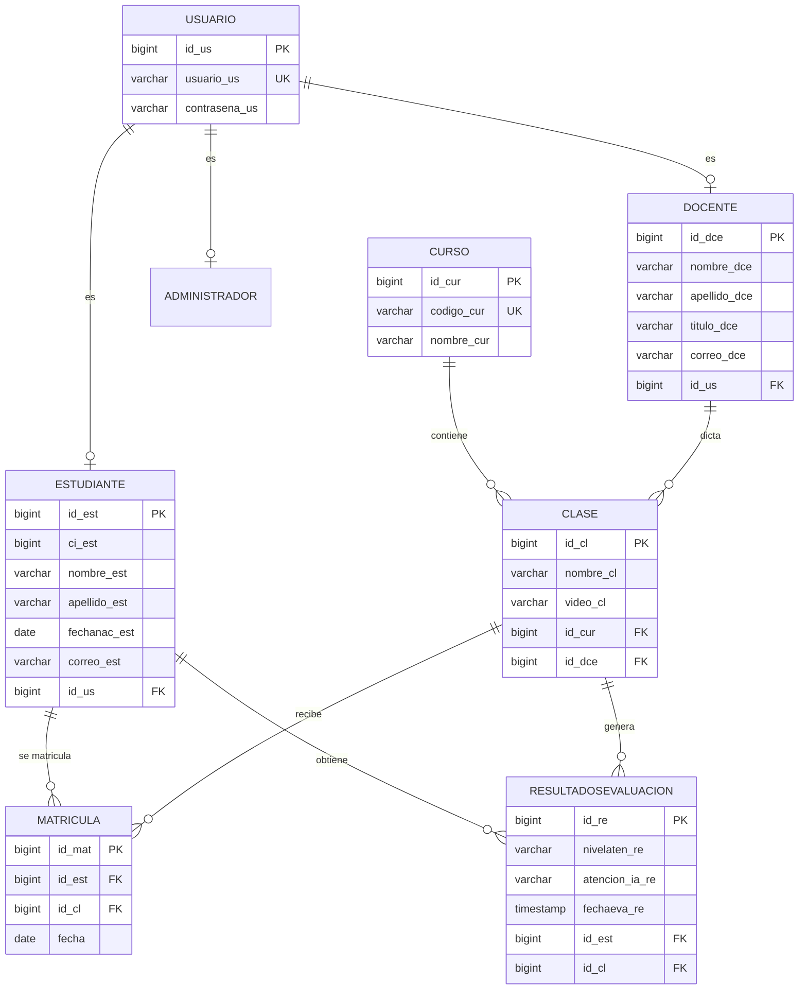

# Sistema web para evaluar el nivel de atención

Plataforma web que mide, con la cámara del propio computador, **qué tan atento
está un estudiante mientras ve una clase en video**, y entrega al docente un
informe con el nivel de atención de cada uno y una recomendación pedagógica.

No se graba ni se sube ningún video del estudiante: el análisis facial ocurre
**dentro del navegador** y al servidor solo viajan métricas numéricas agregadas
(cuántas veces parpadeó, qué porcentaje del tiempo miró al centro, etc.).

---

## Cómo funciona

```
Estudiante abre una clase
          │
          ├── izquierda: video de YouTube embebido (YouTube IFrame API)
          └── derecha:   cámara web  →  MediaPipe FaceLandmarker (478 puntos + iris)
                                              │
                                    por cada fotograma:
                                    · EAR de ambos ojos  → parpadeos
                                    · centro del iris    → mirada izq/centro/der
                                    · ¿hay rostro?       → tiempo sin rostro
                                              │
                              al terminar el video, se agregan las métricas
                                              │
                          POST /api/resultados/  { id_est, id_cl, metrics }
                                              │
                                     Django + RandomForest
                                              │
                              ATENTO · NEUTRO · DISTRAIDO + recomendación
                                              │
                                  se guarda en PostgreSQL
                                              │
                              dashboards de docente y administrador
```

### Qué se mide exactamente

El navegador nunca envía imágenes. Envía este vector de métricas de la sesión:

| Métrica | Qué significa |
|---|---|
| `blink_rate` | parpadeos por minuto (se cuenta un parpadeo cuando el EAR baja de 0,3 durante ≥4 fotogramas) |
| `ear_avg` · `ear_min` · `ear_max` | *Eye Aspect Ratio*: qué tan abiertos están los ojos |
| `gaze_pct.centro` / `.izquierda` / `.derecha` | % del tiempo mirando a cada zona, según la posición del iris entre las comisuras del ojo |
| `noface_pct` | % del tiempo sin rostro detectado (se levantó, se tapó, se fue) |
| `yaw_avg_abs` · `pitch_avg_abs` | giro e inclinación de la cabeza |
| `session_seconds`, `frames_total`, `frames_face` | contexto de la sesión |

### Cómo se decide el nivel

El backend carga un **RandomForest** (`scikit-learn`, 300 árboles,
`class_weight="balanced"`) entrenado sobre esas 10 características. Si el modelo
no está disponible, cae a una **heurística** explícita:

- `noface_pct > 25 %` → **DISTRAIDO**
- mirada al centro ≥ 65 %, |yaw| y |pitch| < 7°, y parpadeo entre 8 y 25/min → **ATENTO**
- mirada al centro < 45 %, o |yaw| o |pitch| > 12°, o parpadeo < 6 o > 30/min → **DISTRAIDO**
- en cualquier otro caso → **NEUTRO**

Cada nivel lleva una recomendación para el docente (segmentar el contenido,
añadir *checks* de comprensión, programar pausas).

---

## Roles

| Rol | Qué puede hacer |
|---|---|
| **Administrador** | CRUD de docentes, estudiantes, cursos, clases y asignaciones (matrículas). Dashboard general. |
| **Docente** | Ver sus cursos y clases, asignarles un video de YouTube, y consultar los resultados de atención de sus estudiantes. |
| **Estudiante** | Ver las clases en las que está matriculado, reproducir el video con la cámara activa y recibir su resultado al terminar. |

El login es por rol: `POST /api/login/?role=estudiante|docente|admin`. Un mismo
`usuario` puede estar vinculado a varios perfiles, y la ruta valida que el rol
solicitado sea uno de los suyos.

---

## Arquitectura

```
├── frontend/                  Next.js 15 · React 19 · TypeScript · Tailwind 4 · shadcn/ui
│   ├── app/
│   │   ├── admin/             login · dashboard · gestión (docente, estudiante, curso, asignaciones)
│   │   ├── docente/           login · dashboard · detalle de curso con resultados
│   │   ├── estudiante/        login · dashboard · reproductor + análisis
│   │   └── lib/api.ts         cliente HTTP de toda la API
│   ├── components/
│   │   ├── AnalizadorAtencion.tsx   ← el núcleo: cámara, MediaPipe y cálculo de métricas
│   │   └── ui/                      componentes shadcn/ui
│   ├── hooks/useYouTube.ts    control del reproductor (play/pause/duración/estado)
│   └── vision/                versión de escritorio en Python (OpenCV + MediaPipe FaceMesh)
│
└── backend/                   Django 5.2 · Django REST Framework · PostgreSQL
    ├── api/
    │   ├── models.py          usuario · estudiante · docente · administrador · curso · clase · matricula · resultadosevaluacion
    │   ├── serializers.py     registro de docente/estudiante (crea el Usuario asociado)
    │   ├── views.py           CRUD + login por rol + evaluación de atención
    │   └── urls.py            rutas de /api/
    └── ia/
        ├── attention_model_rf.py   entrenamiento e inferencia del RandomForest (tiene CLI)
        └── MODELS/                 modelo_rf_v1.joblib
```

### Modelo de datos



### API

| Método | Ruta | Descripción |
|---|---|---|
| POST | `/api/login/?role=` | Login por rol; devuelve `role` y `profile_id` |
| GET·POST | `/api/docentes/` | Listar / registrar docente (crea su usuario) |
| GET·PATCH·DELETE | `/api/docentes/<id>/` | Detalle de docente |
| GET·POST | `/api/estudiantes/` | Listar / registrar estudiante |
| GET·PATCH·DELETE | `/api/estudiantes/<id>/` | Detalle de estudiante |
| GET·POST | `/api/cursos/` | Listar / crear curso |
| GET·PATCH·DELETE | `/api/cursos/<id>/` | Detalle de curso |
| GET·POST | `/api/clases/?id_cur=&id_dce=` | Listar (filtrable) / crear clase |
| GET·PATCH·DELETE | `/api/clases/<id>/` | Detalle de clase (aquí se asigna `video_cl`) |
| GET·POST | `/api/matriculas/` | Listar / crear matrícula |
| POST | `/api/resultados/` | **Evaluar atención**: recibe `metrics`, clasifica y guarda |
| GET | `/api/resultados/?id_est=&id_cl=&id_cur=&latest=1&limit=` | Consultar resultados |

---

## Puesta en marcha

Necesitas **Node 18+**, **Python 3.11+** y **PostgreSQL**.

### 1. Base de datos

Crea una base llamada `atencion_educativa` en PostgreSQL. Las tablas se declaran
en Django con `managed = False`, es decir, **Django no las crea**: hay que
crearlas a mano siguiendo el modelo de datos de arriba (ver
[limitaciones](#estado-y-limitaciones-conocidas)).

Ajusta la conexión en `backend/backend/settings.py` si tu usuario o contraseña
de PostgreSQL no son los del ejemplo.

### 2. Backend

```bash
cd backend
python -m venv env
env\Scripts\activate            # Linux/Mac: source env/bin/activate
pip install django djangorestframework django-cors-headers psycopg2-binary scikit-learn joblib numpy
python manage.py runserver
```

Queda en `http://127.0.0.1:8000`. CORS ya está abierto para `localhost:3000`.

### 3. Frontend

```bash
cd frontend
npm install
npm run dev
```

Queda en `http://localhost:3000`. La primera vez el navegador pedirá **permiso
de cámara**; sin él la evaluación no puede ejecutarse.

### 4. Entrenar el modelo (opcional)

`attention_model_rf.py` trae su propia CLI. Espera una carpeta de JSONs de
sesión; si no traen etiqueta, las genera con la heurística (pseudo-etiquetado):

```bash
cd backend/ia
python attention_model_rf.py train --data ./sesiones --out MODELS/modelo_rf_v1.joblib
python attention_model_rf.py predict-json --predict-json sesion.json --model MODELS/modelo_rf_v1.joblib
```

Imprime el reporte de clasificación y la matriz de confusión sobre el conjunto
de prueba.

---

## Estado y limitaciones conocidas

Este es un proyecto académico y hay cosas a medio cerrar. Se documentan aquí
para que quien lo retome sepa dónde está parado:

- **El RandomForest no se está usando.** `views.py` busca el modelo en
  `backend/api/MODELS/`, pero el archivo vive en `backend/ia/MODELS/`. La carga
  falla en silencio y el sistema cae siempre a la heurística (se nota porque la
  respuesta trae `"modelo": "Heuristica_v1"` en vez de `"RF_v1"`).
- **`yaw_avg_abs` y `pitch_avg_abs` llegan siempre en 0** desde el cliente web:
  el componente aún no calcula la pose de la cabeza. Son 2 de las 10
  características que el modelo espera.
- **No hay esquema SQL ni migraciones.** Todos los modelos son `managed = False`
  y no hay un `.sql` en el repositorio, así que la base hay que reconstruirla a
  mano.
- **No hay `requirements.txt`** en el backend; las dependencias están listadas
  arriba a partir de los imports.
- **Las contraseñas se guardan y comparan en texto plano**, y la API está
  configurada con `AllowAny` sin autenticación: cualquiera que alcance el
  servidor puede leer y modificar todos los datos. Sirve para la demo local; no
  para exponerlo en red.
- **`NEXT_PUBLIC_API_URL`** en `.env.local` no se lee: el código consulta
  `NEXT_PUBLIC_API_BASE`. Funciona solo porque el valor por defecto coincide.
- **`frontend/public/models/face_landmarker.task`** (3,6 MB) está en el
  repositorio pero no se usa: MediaPipe descarga el modelo desde su CDN.
- **`frontend/.next/`** (la caché de compilación, ~70 MB) quedó versionada por
  error y debería salir del repositorio.
- `frontend/vision/` es una **versión de escritorio** independiente
  (`live_attn_min.py` abre la webcam con OpenCV y clasifica en vivo con el mismo
  RandomForest). Funciona por su cuenta, pero la aplicación web no la ejecuta y
  está guardada dentro de `frontend/`, donde no corresponde.

---

## Privacidad

El video de la cámara **nunca sale del navegador**: no se graba, no se sube y no
se almacena. MediaPipe procesa los fotogramas en memoria y lo único que se envía
al servidor son las métricas numéricas agregadas de la tabla de arriba, junto
con el identificador del estudiante y de la clase.

Aun así, el sistema infiere estados atencionales de personas identificadas, así
que su uso debería contar con el consentimiento informado de los estudiantes y
limitarse al fin académico para el que fue construido.
